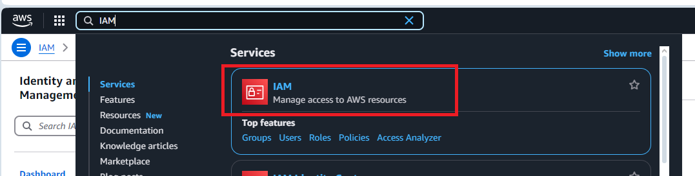
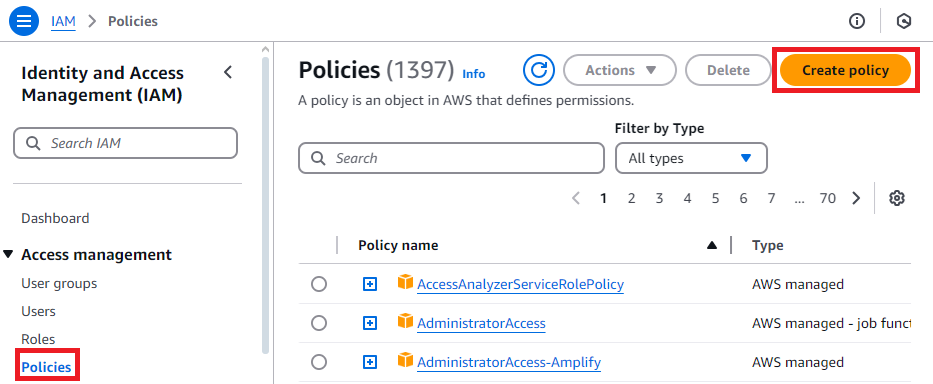
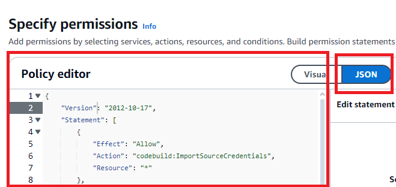
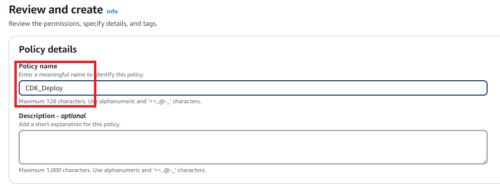
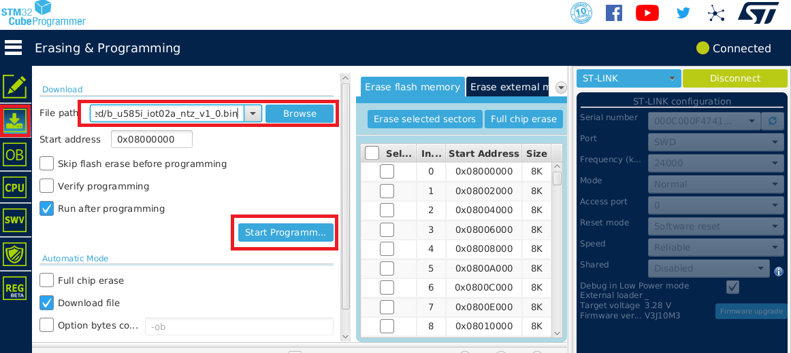

# ML Audio Classifier: Demonstration Setup

## Overview

This guide is designed to assist users in setting up and demonstrating an ML-based audio classification system using AWS, Avnet IoTConnect powered by AWS and the STMicroelectronics STM32U5 Discovery Kit built on the ultra-low-power STM32U585AII6Q microcontroller based on the Arm® Cortex®-M33 core with Arm® TrustZone®. This system demonstrates real-time machine learning inference on edge devices and model retraining, highlighting the integration of cloud and IoT technologies.

While the foundation of the technology can support the classification of events based on most any sensor input (temperature, sound, motion, current, ect.), this solution utilizes the Discovery Kit's 2 microphones for audio classification. The trained audio models are stored in the Models folder of the project, and with automation of the included *../scripts/setup-project.sh* script, these models are incorporated into the project and the MCU binary is built. The out-of-the-box demo incorporates 5 audio classifications to identify the following scenarios: *Honking, Car Racing, Alarms, Dog(s) Barking, and Rushing Water*. When an event is triggered by the corresponding sound, the event name, confidence level, and GPS location of the audio classifier node is sent to the cloud to alert the user.

This guide outlines the steps to recreate the demo.

## Deployment

The project is built using GitHub actions, CDK IaC and IoTConnect REST API. So it can be deployed to your AWS account directly from the GitHub.

**Note** This Project was only tested on region `eu-west-2`

### AWS Setup

It is necessary to set up a connection between the pipeline and your forked Repo

1. Follow the steps to create & verify the connection [here](https://docs.aws.amazon.com/dtconsole/latest/userguide/connections-create-github.html)
2. Copy created Connection Arn. We will need it during the GitHub Secrets setup.

Now lets create AWS Credentials. In AWS go to IAM Service.



Start with creating the Policy.

1. Go to Policies and press "Create policy"
   

2. In Policy editor switch to JSON and paste the bellow text into it. Check https://github.com/aws/aws-cdk/issues/21937 for possible changes in required policies. And press "Next".

   ```
   {
       "Version": "2012-10-17",
       "Statement": [
           {
               "Effect": "Allow",
               "Action": "codebuild:ImportSourceCredentials",
               "Resource": "*"
           },
           {
               "Effect": "Allow",
               "Action": "sts:AssumeRole",
               "Resource": "arn:aws:iam::*:role/cdk-*"
           },
           {
               "Action": [
                   "cloudformation:CreateChangeSet",
                   "cloudformation:DeleteStack",
                   "cloudformation:DescribeChangeSet",
                   "cloudformation:DescribeStackEvents",
                   "cloudformation:DescribeStacks",
                   "cloudformation:ExecuteChangeSet",
                   "cloudformation:GetTemplate"
               ],
               "Resource": "arn:aws:cloudformation:*:*:stack/CDKToolkit-StMicro/*",
               "Effect": "Allow",
               "Sid": "CloudFormationPermissions"
           },
           {
               "Action": [
                   "iam:CreateRole",
                   "iam:DeleteRole",
                   "iam:GetRole",
                   "iam:AttachRolePolicy",
                   "iam:DetachRolePolicy",
                   "iam:DeleteRolePolicy",
                   "iam:PutRolePolicy",
                   "iam:TagRole"
               ],
               "Effect": "Allow",
               "Resource": [
                   "arn:aws:iam::*:policy/*",
                   "arn:aws:iam::*:role/cdk-*"
               ]
           },
           {
               "Action": [
                   "s3:CreateBucket",
                   "s3:DeleteBucket",
                   "s3:PutBucketPolicy",
                   "s3:DeleteBucketPolicy",
                   "s3:PutBucketPublicAccessBlock",
                   "s3:PutBucketVersioning",
                   "s3:PutEncryptionConfiguration",
                   "s3:PutLifecycleConfiguration"
               ],
               "Effect": "Allow",
               "Resource": [
                   "arn:aws:s3:::cdk-*"
               ]
           },
           {
               "Action": [
                   "ssm:DeleteParameter",
                   "ssm:GetParameter",
                   "ssm:GetParameters",
                   "ssm:PutParameter"
               ],
               "Effect": "Allow",
               "Resource": [
                   "arn:aws:ssm:*:*:parameter/cdk-bootstrap/*"
               ]
           },
           {
               "Action": [
                   "ecr:CreateRepository",
                   "ecr:DeleteRepository",
                   "ecr:DescribeRepositories",
                   "ecr:SetRepositoryPolicy",
                   "ecr:PutLifecyclePolicy"
               ],
               "Effect": "Allow",
               "Resource": [
                   "arn:aws:ecr:*:*:repository/cdk-*"
               ]
           }
       ]
   }
   ```

   

3. Name the policy "CDK_Deploy" and press "Create policy".
   

Now create the user group

1. tbd

### Firmware Flashing and Getting Certificate

- Download and install a serial console application (TeraTerm for example) and STM32CubeProgrammer
- Download and extract [b_u585i_iot02a_ntz_v1_4_1.zip](https://saleshosted.z13.web.core.windows.net/demo/st/b_u585i_iot02a_ntz_v1_4_0.zip) !!!!!!!!!TBD!!!!!!!!!
- This is a non-TFM project. If tustzone is enabled on your board, please disable before programming.
- Connect the board with a Micro USB to a PC cable located on the top of the board. Do not connect the USB-C port or the micro USB port at the bottom.
- Open the STM32CubeProgrammer and connect it to the board by clicking the *Connect* button on the top right.
- Click the *Erasing&Programming* button (second button on the left sidebar)
  - It is recommended to run a *Full Chip Erase* (top right of the screen), but this step is optional.
  - Click *Browse* and navigate to your unzipped .bin file.
  - *Start Address* should be auto-detected to 0x08000000.
  - Click the *Start Programming* button (see the screenshot below).
- Once flashing is complete Disconnect the board from the programmer and re-plug the device.



#### Configuring Device Certificates

- To configure the Server CA certificate, a commands needs to be executed on the serial terminal console that will take the certificate as input.
- Open the serial console terminal. If you are seeing no output, you can type **help** on the terminal to trigger the device to respond.
- Next, we need to configure the Server CA certificate. The command will expect the certificate to be pasted along with the BEGIN and END lines. If this process is successful, a log line will print *Success: Certificate loaded to label: 'root_ca_cert'*. Ignore the "Could not open" warnings on the screen during the process. Run the following command and paste the [Starfield Root CA G2 Certificate](https://github.com/avnet-iotconnect/iotc-freertos-stm32-u5-ml-demo/blob/main/QUICKSTART.md#Starfield-Root-CA-G2) below at the ">" prompt:
  - pki import cert root_ca_cert
- To generate the device's X509 credentials, we will need to generate a private key and a self-signed certificate based on the public/private key pair that's also generated internally. Enter the following commands:
  - pki generate key
  - pki generate cert
- Capture the certificate output of the pki generate cert command along with BEGIN CERTIFICATE and END CERTIFICATE lines and paste it into a file - we will need it during the GitHub Secrets setup.
- You can always obtain the same generated certificate by executing **pki export cert tls_cert** at the command prompt.
- Keep the terminal application open. We will need it again to configure the device connection details.

### Credentials Preparation

Before the solution can be deployed to the cloud it is necessary to gather credentials and provide it into the GitHub secrets.

#### AWS