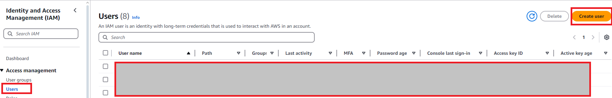
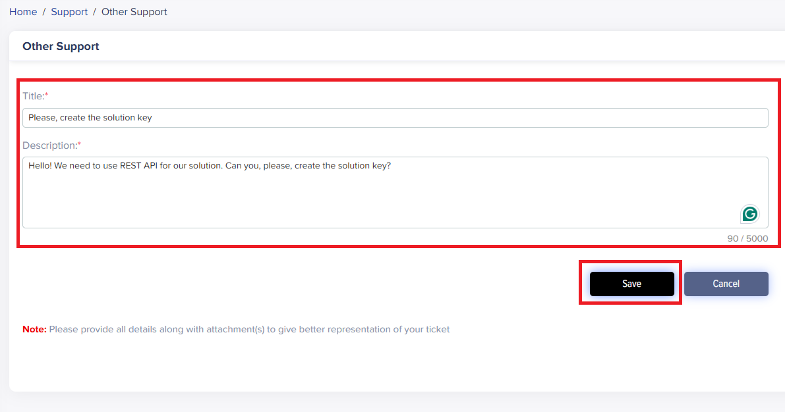

# ML Audio Classifier: Demonstration Setup

## Overview

This guide is designed to assist users in setting up and demonstrating an ML-based audio classification system using AWS, Avnet IoTConnect powered by AWS and the STMicroelectronics STM32U5 Discovery Kit built on the ultra-low-power STM32U585AII6Q microcontroller based on the Arm® Cortex®-M33 core with Arm® TrustZone®. This system demonstrates real-time machine learning inference on edge devices and model retraining, highlighting the integration of cloud and IoT technologies.

While the foundation of the technology can support the classification of events based on most any sensor input (temperature, sound, motion, current, ect.), this solution utilizes the Discovery Kit's 2 microphones for audio classification. The trained audio models are stored in the Models folder of the project, and with automation of the included *../scripts/setup-project.sh* script, these models are incorporated into the project and the MCU binary is built. The out-of-the-box demo incorporates 5 audio classifications to identify the following scenarios: *Honking, Car Racing, Alarms, Dog(s) Barking, and Rushing Water*. When an event is triggered by the corresponding sound, the event name, confidence level, and GPS location of the audio classifier node is sent to the cloud to alert the user.

This guide outlines the steps to recreate the demo.

## Deployment Prerequisites

The project is built using GitHub actions, CDK IaC and IoTConnect REST API. So it can be deployed to your AWS account directly from the GitHub.

**Note** This Project was only tested on region `eu-west-2`

### AWS Setup

#### GitHub Connection

It is necessary to set up a connection between the pipeline and your forked Repo

1. Follow the steps to create & verify the connection [here](https://docs.aws.amazon.com/dtconsole/latest/userguide/connections-create-github.html)
2. Copy created Connection Arn. We will need it during the GitHub Secrets setup

#### Credentials

Now lets create AWS Credentials. In AWS go to IAM Service.


Start with creating the Policy.

1. Go to Policies and press "Create policy"
   

2. In Policy editor switch to JSON and paste the bellow text into it. Check https://github.com/aws/aws-cdk/issues/21937 for possible changes in required policies. And press "Next".

   ```
   {
       "Version": "2012-10-17",
       "Statement": [
           {
               "Effect": "Allow",
               "Action": "codebuild:ImportSourceCredentials",
               "Resource": "*"
           },
           {
               "Effect": "Allow",
               "Action": "sts:AssumeRole",
               "Resource": "arn:aws:iam::*:role/cdk-*"
           },
           {
               "Action": [
                   "cloudformation:CreateChangeSet",
                   "cloudformation:DeleteStack",
                   "cloudformation:DescribeChangeSet",
                   "cloudformation:DescribeStackEvents",
                   "cloudformation:DescribeStacks",
                   "cloudformation:ExecuteChangeSet",
                   "cloudformation:GetTemplate"
               ],
               "Resource": "arn:aws:cloudformation:*:*:stack/CDKToolkit-StMicro/*",
               "Effect": "Allow",
               "Sid": "CloudFormationPermissions"
           },
           {
               "Action": [
                   "iam:CreateRole",
                   "iam:DeleteRole",
                   "iam:GetRole",
                   "iam:AttachRolePolicy",
                   "iam:DetachRolePolicy",
                   "iam:DeleteRolePolicy",
                   "iam:PutRolePolicy",
                   "iam:TagRole"
               ],
               "Effect": "Allow",
               "Resource": [
                   "arn:aws:iam::*:policy/*",
                   "arn:aws:iam::*:role/cdk-*"
               ]
           },
           {
               "Action": [
                   "s3:CreateBucket",
                   "s3:DeleteBucket",
                   "s3:PutBucketPolicy",
                   "s3:DeleteBucketPolicy",
                   "s3:PutBucketPublicAccessBlock",
                   "s3:PutBucketVersioning",
                   "s3:PutEncryptionConfiguration",
                   "s3:PutLifecycleConfiguration"
               ],
               "Effect": "Allow",
               "Resource": [
                   "arn:aws:s3:::cdk-*"
               ]
           },
           {
               "Action": [
                   "ssm:DeleteParameter",
                   "ssm:GetParameter",
                   "ssm:GetParameters",
                   "ssm:PutParameter"
               ],
               "Effect": "Allow",
               "Resource": [
                   "arn:aws:ssm:*:*:parameter/cdk-bootstrap/*"
               ]
           },
           {
               "Action": [
                   "ecr:CreateRepository",
                   "ecr:DeleteRepository",
                   "ecr:DescribeRepositories",
                   "ecr:SetRepositoryPolicy",
                   "ecr:PutLifecyclePolicy"
               ],
               "Effect": "Allow",
               "Resource": [
                   "arn:aws:ecr:*:*:repository/cdk-*"
               ]
           }
       ]
   }
   ```

   

3. Give the policy a name, e.g. "CDK_Deploy", and press "Create policy"
   

Now create the user group

1. In IAM go to User groups and press "Create group"
   
2. Give group a name, e.g. "CDK_Deploy" and in "Attach permissions policies" find and check the polucy you created earlier
   
3. Press "Create user group"

Now create the user

1. In IAM go to Users and press "Create user"
   
2. Give user a name, e.g. "cdk-deploy" and press "Next"
   
3. On the next step find a check the group you previously created, press "Next"
   
4. On the next step press "Create user"
   

Now create an access key and a secret access key for the new user.

1. In IAM go to Users and press on the prebiously created user
   
2. Go to Security credentials and press "Create access key"
   
3. Choose "Command Line Interface (CLI)" Use case, check the confirmation and press "Next"
   
4. Fill the Description tag value if you want and press "Create access key"
   
5. Copy and save both "Access key" and "Secret access key", you will need them later and press "Done"
   

### ST Account Setup

ST Cloud credentials:

- Create an account in [STM32Cube.AI Developer Cloud](https://stm32ai-cs.st.com/home)
- Login and accept an agreement
- Copy login and password, you will need them later

### IoTConnect Setup

You should have account in Avnet IoTConnect powered by AWS. Retreive the following things from IoTConnect account:

- Solution key
- Login
- Password
- Entity name

Uou will need it later.

If you don't have the solution key - in IoT Connect go to Support Ticket -> Other Support and create ticket with title "Please, create the solution key" and description "Hello! We need to use REST API for our solution. Can you, please, create the solution key?" and press "Save". Support team will create the solution key for you.




### Firmware Flashing and Getting Certificate

- Download and install a serial console application (TeraTerm for example) and STM32CubeProgrammer
- Download and extract [b_u585i_iot02a_ntz_v1_4_1.zip](https://saleshosted.z13.web.core.windows.net/demo/st/b_u585i_iot02a_ntz_v1_4_0.zip) !!!!!!!!!TBD!!!!!!!!!
- This is a non-TFM project. If tustzone is enabled on your board, please disable before programming.
- Connect the board with a Micro USB to a PC cable located on the top of the board. Do not connect the USB-C port or the micro USB port at the bottom.
- Open the STM32CubeProgrammer and connect it to the board by clicking the *Connect* button on the top right.
- Click the *Erasing&Programming* button (second button on the left sidebar)
  - It is recommended to run a *Full Chip Erase* (top right of the screen), but this step is optional.
  - Click *Browse* and navigate to your unzipped .bin file.
  - *Start Address* should be auto-detected to 0x08000000.
  - Click the *Start Programming* button (see the screenshot below).
- Once flashing is complete Disconnect the board from the programmer and re-plug the device.


#### Configuring Device Certificates

- To configure the Server CA certificate, a commands needs to be executed on the serial terminal console that will take the certificate as input.
- Open the serial console terminal. If you are seeing no output, you can type **help** on the terminal to trigger the device to respond.
- Next, we need to configure the Server CA certificate. The command will expect the certificate to be pasted along with the BEGIN and END lines. If this process is successful, a log line will print *Success: Certificate loaded to label: 'root_ca_cert'*. Ignore the "Could not open" warnings on the screen during the process. Run the following command and paste the [Starfield Root CA G2 Certificate](https://github.com/avnet-iotconnect/iotc-freertos-stm32-u5-ml-demo/blob/main/QUICKSTART.md#Starfield-Root-CA-G2) below at the ">" prompt:
  - pki import cert root_ca_cert
- To generate the device's X509 credentials, we will need to generate a private key and a self-signed certificate based on the public/private key pair that's also generated internally. Enter the following commands:
  - pki generate key
  - pki generate cert
- Capture the certificate output of the pki generate cert command along with BEGIN CERTIFICATE and END CERTIFICATE lines and paste it into a file - we will need it during the GitHub Secrets setup.
- You can always obtain the same generated certificate by executing **pki export cert tls_cert** at the command prompt.
- Keep the terminal application open. We will need it again to configure the device connection details.

### Credentials Preparation

Before the solution can be deployed to the cloud it is necessary to provide the credentials into the GitHub secrets.

In GitHub repository go to Settings -> Secrets and variables -> Actions and fill the secret values:

- AWS_ACCESS_KEY: AWS access key you previously
- AWS_ACCOUNT_NUMBER: AWS account number
- AWS_REGION: AWS region in which you want to deploy the demo
- AWS_SECRET_ACCESS_KEY: AWS secret access key you previously
- GIT_ARN: ARN of the GitHub connection in the AWS
- IOT_CONNECT_CERTIFICATE: the certificate you captured from the device
- IOT_CONNECT_ENTITY_NAME: your Entity name in the IoTConnect account
- IOT_CONNECT_PASSWORD: your password for IoTConnect account
- IOT_CONNECT_SOLUTION_KEY: your solution key in the IoTConnect account
- IOT_CONNECT_USERNAME: your login for IoTConnect account
- STDEVCLOUD_PASSWORD: your password for [STM32Cube.AI Developer Cloud](https://stm32ai-cs.st.com/home) account
- STDEVCLOUD_USERNAME: your login for [STM32Cube.AI Developer Cloud](https://stm32ai-cs.st.com/home) account


## Deployment

### CDK Bootstrap

The deploy should start from the CDK bootstrap. In repository go to Actions -> Bootstrap CDK. Press on the "Run workflow" dropdown, choose main branch and press "Run workflow".


Wait till the action is finished.


#### Troubleshooting

If action is failed most likely credentials in secrets are wrong or policy created previously is wrong. AWS sometimes update permissions list needed for the CDK bootstrap. You can avoid this issue by changing the policy to allow all possible action on all possible resources - but keep in mind that it is not good practise.

```
{
  "Version": "2012-10-17",
  "Statement": {
    "Effect": "Allow",
    "Action": "*",
    "Resource": "*"
  }
}
```

### Deploy

Now the solution could be deployed.

In repository go to Actions -> Solution Deploy. Press on the "Run workflow" dropdown, choose main branch and press "Run workflow".

This action will deploy infrastructure to the AWS and IoTConnect.


Wait till the action is finished.


Ater action is successfuly finished, the audio files download process will be automatically started in the AWS. You can't start retraining process before this process is finished. It usually takes from 30 to 60 minutes. To check the downloading progress, you can go in CodeBuild in AWS.


Go to "Build projects" and press on the "DownloadBuild" project.


Press on the build run which is "in Progress"


You will see the downloading log. The process order:

1. Downloading Dev Audio (6 parts)
2. Downloading Eval Audio
3. Downloading Ground Truth
4. Unzipping
5. Uploading to S3

When you will see in the log "Phase complete: BUILD State: SUCCEEDED" - the files are in S3, which means that you can start the retraining.

### Configuring Device Connection Parameters

Now it is necessary to configure the Device Connection Parameters. In IoTConnect go to the device Info tab


Go to the Devices and press on the "soundclass" device.


Press on the "Connection info".


Note the following values in the device Connection info screen which we will use for the device runtime configuration in the next steps:

- Your Unique Device ID that you used to create the device will be used as thing_name.
- Host, which will be used for the mqtt_endpoint value.


- Enter the following commands on the serial terminal to configure the MQTT connection:
  - conf set thing_name your-device-id
    - To take advantage of the GPS location feature, the user should assign their device one of the following names to correspond with a unique GPS location: ml-ai-demo-01, ml-ai-demo-02, ml-ai-demo-03, or ml-ai-demo-04.
  - conf set mqtt_endpoint your-endpoint
  - conf set mqtt_port 8883
- Enter the following commands to set up the WiFi connection for your device:
  - conf set wifi_ssid your-wifi-ssid
  - conf set wifi_credential your-wifi-password
- Verify values by entering the **conf get** command and examining the output.
- Enter **conf commit**. Note that must commit the changes so that they take effect.
- Enter **reset** to reset the device.

The device should connect at this point, and you should be able to see data in the Telemetry and Latest Value tabs in IoTConnect.

