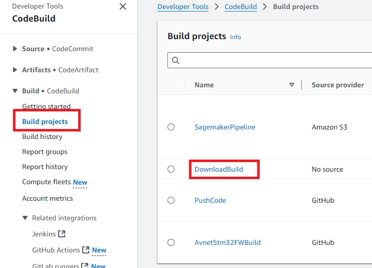

# ML Audio Classifier: Demonstration Setup

[TOC]

## Overview

This guide is designed to assist users in setting up and demonstrating an ML-based audio classification system using AWS, Avnet IoTConnect powered by AWS and the STMicroelectronics STM32U5 Discovery Kit built on the ultra-low-power STM32U585AII6Q microcontroller based on the Arm® Cortex®-M33 core with Arm® TrustZone®. This system demonstrates real-time machine learning inference on edge devices and model retraining, highlighting the integration of cloud and IoT technologies.

While the foundation of the technology can support the classification of events based on most any sensor input (temperature, sound, motion, current, ect.), this solution utilizes the Discovery Kit's 2 microphones for audio classification. The trained audio models are stored in the Models folder of the project, and with automation of the included *../scripts/setup-project.sh* script, these models are incorporated into the project and the MCU binary is built. The out-of-the-box demo incorporates 5 audio classifications to identify the following scenarios: *Honking, Car Racing, Alarms, Dog(s) Barking, and Rushing Water*. When an event is triggered by the corresponding sound, the event name, confidence level, and GPS location of the audio classifier node is sent to the cloud to alert the user.

This guide outlines the steps to recreate the demo.

## Deployment Prerequisites

The project is built using GitHub Actions, CDK IaC, and the IoTConnect REST API, so it can be deployed to your AWS account directly from GitHub.

**Note:** This project was only tested in the `eu-west-2` region.

### AWS Setup

#### GitHub Connection

It is necessary to set up a connection between the pipeline and your forked repository.

1. Follow the steps to create and verify the connection [here](https://docs.aws.amazon.com/dtconsole/latest/userguide/connections-create-github.html).  
2. Copy the created connection ARN. You will need it during the GitHub Secrets setup.

#### Credentials

Now let's create AWS Credentials. In AWS Management Console, go to the IAM Service.


Start by creating the Policy.

1. Go to Policies and click "Create policy"
   

2. In the "Policy editor", switch to JSON and paste the text below into it. Check [this GitHub issue](https://github.com/aws/aws-cdk/issues/21937) for possible changes in required policies. Then click "Next".

   ```
   {
       "Version": "2012-10-17",
       "Statement": [
           {
               "Effect": "Allow",
               "Action": "codebuild:ImportSourceCredentials",
               "Resource": "*"
           },
           {
               "Effect": "Allow",
               "Action": "sts:AssumeRole",
               "Resource": "arn:aws:iam::*:role/cdk-*"
           },
           {
               "Action": [
                   "cloudformation:CreateChangeSet",
                   "cloudformation:DeleteStack",
                   "cloudformation:DescribeChangeSet",
                   "cloudformation:DescribeStackEvents",
                   "cloudformation:DescribeStacks",
                   "cloudformation:ExecuteChangeSet",
                   "cloudformation:GetTemplate"
               ],
               "Resource": "arn:aws:cloudformation:*:*:stack/CDKToolkit-StMicro/*",
               "Effect": "Allow",
               "Sid": "CloudFormationPermissions"
           },
           {
               "Action": [
                   "iam:CreateRole",
                   "iam:DeleteRole",
                   "iam:GetRole",
                   "iam:AttachRolePolicy",
                   "iam:DetachRolePolicy",
                   "iam:DeleteRolePolicy",
                   "iam:PutRolePolicy",
                   "iam:TagRole"
               ],
               "Effect": "Allow",
               "Resource": [
                   "arn:aws:iam::*:policy/*",
                   "arn:aws:iam::*:role/cdk-*"
               ]
           },
           {
               "Action": [
                   "s3:CreateBucket",
                   "s3:DeleteBucket",
                   "s3:PutBucketPolicy",
                   "s3:DeleteBucketPolicy",
                   "s3:PutBucketPublicAccessBlock",
                   "s3:PutBucketVersioning",
                   "s3:PutEncryptionConfiguration",
                   "s3:PutLifecycleConfiguration"
               ],
               "Effect": "Allow",
               "Resource": [
                   "arn:aws:s3:::cdk-*"
               ]
           },
           {
               "Action": [
                   "ssm:DeleteParameter",
                   "ssm:GetParameter",
                   "ssm:GetParameters",
                   "ssm:PutParameter"
               ],
               "Effect": "Allow",
               "Resource": [
                   "arn:aws:ssm:*:*:parameter/cdk-bootstrap/*"
               ]
           },
           {
               "Action": [
                   "ecr:CreateRepository",
                   "ecr:DeleteRepository",
                   "ecr:DescribeRepositories",
                   "ecr:SetRepositoryPolicy",
                   "ecr:PutLifecyclePolicy"
               ],
               "Effect": "Allow",
               "Resource": [
                   "arn:aws:ecr:*:*:repository/cdk-*"
               ]
           }
       ]
   }
   ```

   

3. Give the policy a name, e.g., "CDK_Deploy," and click "Create policy".
   

Now, create the user group

1. In IAM, go to User groups and click "Create group".
   
2. Give the group a name, e.g., "CDK_Deploy," and in "Attach permissions policies," find and check the policy you created earlier.
   
3. Click "Create user group"

Now, create the user

1. In IAM, go to Users and click "Create user"
   
2. Give the user a name, e.g., "cdk-deploy," and click "Next".
   
3. On the next step, find and check the group you previously created, then click "Next".
   
4. On the next step, click "Create user".
   

Now, create an access key and a secret access key for the new user.

1. In IAM, go to Users and click on the previously created user.
   
2. Go to Security credentials and click "Create access key".
   
3. Choose the "Command Line Interface (CLI)" Use case, check the confirmation, and click "Next".
   
4. Fill in the Description tag value if desired, and click "Create access key".
   
5. Copy and save both the "Access key" and "Secret access key". You will need them later, then click "Done".
   

### ST Account Setup

ST Cloud credentials:

- Create an account in [STM32Cube.AI Developer Cloud](https://stm32ai-cs.st.com/home).
- Log in and accept the agreement.
- Copy the login and password, you will need them later.

### IoTConnect Setup

You should have an account in Avnet IoTConnect powered by AWS. Retrieve the following items from your IoTConnect account:

- Solution key  
- Login  
- Password  
- Entity name  

You will need these later.

If you don't have the solution key, go to IoTConnect, navigate to **Support Ticket -> Other Support**, and create a ticket with the title "Please, create the solution key" and the description: "Hello! We need to use REST API for our solution. Can you, please, create the solution key?".
Then click "Save". The support team will create the solution key for you.


### Firmware Flashing and Getting Certificate

- Download and install a serial console application (TeraTerm for example) and STM32CubeProgrammer.
- Download and extract [b_u585i_iot02a_ntz_ml_01.zip](https://saleshosted.z13.web.core.windows.net/demo/st/b_u585i_iot02a_ntz-ml-01.zip).
- This is a non-TFM project. If tustzone is enabled on your board, please disable before programming.
- Connect the board with a Micro USB to a PC cable located on the top of the board. Do not connect the USB-C port or the micro USB port at the bottom.
- Open the STM32CubeProgrammer and connect it to the board by clicking the *Connect* button on the top right.
- Click the *Erasing&Programming* button (second button on the left sidebar)
  - It is recommended to run a *Full Chip Erase* (top right of the screen), but this step is optional.
  - Click *Browse* and navigate to your unzipped .bin file.
  - *Start Address* should be auto-detected to 0x08000000.
  - Click the *Start Programming* button (see the screenshot below).
- Once flashing is complete Disconnect the board from the programmer and re-plug the device.


#### Configuring Device Certificates

- To configure the Server CA certificate, a commands needs to be executed on the serial terminal console that will take the certificate as input.
- Open the serial console terminal. If you are seeing no output, you can type **help** on the terminal to trigger the device to respond.
- Next, we need to configure the Server CA certificate. The command will expect the certificate to be pasted along with the BEGIN and END lines. If this process is successful, a log line will print *Success: Certificate loaded to label: 'root_ca_cert'*. Ignore the "Could not open" warnings on the screen during the process. Run the following command and paste the [Starfield Root CA G2 Certificate](https://github.com/avnet-iotconnect/iotc-freertos-stm32-u5-ml-demo/blob/main/QUICKSTART.md#Starfield-Root-CA-G2) below at the ">" prompt:
  - pki import cert root_ca_cert
- To generate the device's X509 credentials, we will need to generate a private key and a self-signed certificate based on the public/private key pair that's also generated internally. Enter the following commands:
  - pki generate key
  - pki generate cert
- Capture the certificate output of the pki generate cert command along with BEGIN CERTIFICATE and END CERTIFICATE lines and paste it into a file - we will need it during the GitHub Secrets setup.
- You can always obtain the same generated certificate by executing **pki export cert tls_cert** at the command prompt.
- Keep the terminal application open. We will need it again to configure the device connection details.

##### Starfield Root CA G2

```pem
-----BEGIN CERTIFICATE-----
MIID7zCCAtegAwIBAgIBADANBgkqhkiG9w0BAQsFADCBmDELMAkGA1UEBhMCVVMx
EDAOBgNVBAgTB0FyaXpvbmExEzARBgNVBAcTClNjb3R0c2RhbGUxJTAjBgNVBAoT
HFN0YXJmaWVsZCBUZWNobm9sb2dpZXMsIEluYy4xOzA5BgNVBAMTMlN0YXJmaWVs
ZCBTZXJ2aWNlcyBSb290IENlcnRpZmljYXRlIEF1dGhvcml0eSAtIEcyMB4XDTA5
MDkwMTAwMDAwMFoXDTM3MTIzMTIzNTk1OVowgZgxCzAJBgNVBAYTAlVTMRAwDgYD
VQQIEwdBcml6b25hMRMwEQYDVQQHEwpTY290dHNkYWxlMSUwIwYDVQQKExxTdGFy
ZmllbGQgVGVjaG5vbG9naWVzLCBJbmMuMTswOQYDVQQDEzJTdGFyZmllbGQgU2Vy
dmljZXMgUm9vdCBDZXJ0aWZpY2F0ZSBBdXRob3JpdHkgLSBHMjCCASIwDQYJKoZI
hvcNAQEBBQADggEPADCCAQoCggEBANUMOsQq+U7i9b4Zl1+OiFOxHz/Lz58gE20p
OsgPfTz3a3Y4Y9k2YKibXlwAgLIvWX/2h/klQ4bnaRtSmpDhcePYLQ1Ob/bISdm2
8xpWriu2dBTrz/sm4xq6HZYuajtYlIlHVv8loJNwU4PahHQUw2eeBGg6345AWh1K
Ts9DkTvnVtYAcMtS7nt9rjrnvDH5RfbCYM8TWQIrgMw0R9+53pBlbQLPLJGmpufe
hRhJfGZOozptqbXuNC66DQO4M99H67FrjSXZm86B0UVGMpZwh94CDklDhbZsc7tk
6mFBrMnUVN+HL8cisibMn1lUaJ/8viovxFUcdUBgF4UCVTmLfwUCAwEAAaNCMEAw
DwYDVR0TAQH/BAUwAwEB/zAOBgNVHQ8BAf8EBAMCAQYwHQYDVR0OBBYEFJxfAN+q
AdcwKziIorhtSpzyEZGDMA0GCSqGSIb3DQEBCwUAA4IBAQBLNqaEd2ndOxmfZyMI
bw5hyf2E3F/YNoHN2BtBLZ9g3ccaaNnRbobhiCPPE95Dz+I0swSdHynVv/heyNXB
ve6SbzJ08pGCL72CQnqtKrcgfU28elUSwhXqvfdqlS5sdJ/PHLTyxQGjhdByPq1z
qwubdQxtRbeOlKyWN7Wg0I8VRw7j6IPdj/3vQQF3zCepYoUz8jcI73HPdwbeyBkd
iEDPfUYd/x7H4c7/I9vG+o1VTqkC50cRRj70/b17KSa7qWFiNyi2LSr2EIZkyXCn
0q23KXB56jzaYyWf/Wi3MOxw+3WKt21gZ7IeyLnp2KhvAotnDU0mV3HaIPzBSlCN
sSi6
-----END CERTIFICATE-----
```

### Credentials Preparation

Before the solution can be deployed to the cloud, it is necessary to provide the credentials in the GitHub secrets.

In your GitHub repository, go to **Settings -> Secrets and variables -> Actions** and fill in the secret values:

- **AWS_ACCESS_KEY**: The AWS access key you previously created.  
- **AWS_ACCOUNT_NUMBER**: Your AWS account number.  
- **AWS_REGION**: The AWS region where you want to deploy the demo. **Make sure that the GitHub Connection you created earlier is set for use in this region!**
- **AWS_SECRET_ACCESS_KEY**: The AWS secret access key you previously created.  
- **GIT_ARN**: The ARN of the GitHub connection in AWS.  
- **IOT_CONNECT_CERTIFICATE**: The certificate you captured from the device.  
- **IOT_CONNECT_ENTITY_NAME**: Your entity name in the IoTConnect account.  
- **IOT_CONNECT_PASSWORD**: Your password for the IoTConnect account.  
- **IOT_CONNECT_SOLUTION_KEY**: Your solution key in the IoTConnect account.  
- **IOT_CONNECT_USERNAME**: Your login for the IoTConnect account.  
- **STDEVCLOUD_PASSWORD**: Your password for your [STM32Cube.AI Developer Cloud](https://stm32ai-cs.st.com/home) account.  
- **STDEVCLOUD_USERNAME**: Your login for your [STM32Cube.AI Developer Cloud](https://stm32ai-cs.st.com/home) account.


## Deployment

### CDK Bootstrap

The deployment should start with the CDK bootstrap. In the repository, go to **Actions -> Bootstrap CDK**, click on the "Run workflow" dropdown, select the main branch, and click "Run workflow".


Wait untill the action is finished.


#### Troubleshooting

If the action fails, it is most likely because the credentials in the secrets are incorrect or the policy created previously is wrong. AWS occasionally updates the permissions list needed for the CDK bootstrap. 

You can avoid this issue by changing the policy to allow all possible actions on all resources—however, keep in mind that this is not a good practice.

```
{
  "Version": "2012-10-17",
  "Statement": {
    "Effect": "Allow",
    "Action": "*",
    "Resource": "*"
  }
}
```

### Deploy

Now the solution can be deployed.

In the repository, go to **Actions -> Solution Deploy**, click on the "Run workflow" dropdown, select the main branch, and click "Run workflow".

This action will deploy the infrastructure to AWS and IoTConnect.


Wait untill the action is finished.


After the action is successfully finished, the audio file download process will automatically start in AWS. You cannot start the retraining process until this process is finished. It usually takes 30 to 60 minutes. To check the download progress, go to CodeBuild in AWS.


Go to "Build projects" and click on the "DownloadBuild" project.



Click on the build run that is "In Progress".


You will see the download log. The process order is as follows:

1. Downloading Dev Audio (6 parts)  
2. Downloading Eval Audio  
3. Downloading Ground Truth  
4. Unzipping  
5. Uploading to S3  

When you see in the log "Phase complete: BUILD State: SUCCEEDED," the files are in S3, which means you can start the retraining.

#### Troubleshooting

If **Solution Deploy** GitHub Action fails with the following reason:

`Failed to call CreateWebhook, reason: Access token not found in CodeBuild project for server type github (Service: AWSCodeBuild; Status Code: 400; Error Code: ResourceNotFoundException`

This means that the GitHub Connection is set for using in other region. To allow using it in your region, in AWS, go to the **CodeBuild**.


Go to the **Settings -> Connections** and click on your connection.


In **Use this connection** change the region to the desired.


### Configuring Device Connection Parameters

Now, it is necessary to configure the Device Connection Parameters. In IoTConnect, go to the **Device Info** tab.


Go to **Devices** and click on the "soundclass" device.


Click on **Connection info**.


Note the following values from the **Connection info** screen, which will be used for the device runtime configuration in the next steps:

- **Your Unique Device ID**: This will be used as `thing_name`.  
- **Host**: This will be used as the `mqtt_endpoint` value.


- Enter the following commands on the serial terminal to configure the MQTT connection:
  - conf set thing_name your-device-id
    - To take advantage of the GPS location feature, the user should assign their device one of the following names to correspond with a unique GPS location: ml-ai-demo-01, ml-ai-demo-02, ml-ai-demo-03, or ml-ai-demo-04.
  - conf set mqtt_endpoint your-endpoint
  - conf set mqtt_port 8883
- Enter the following commands to set up the WiFi connection for your device:
  - conf set wifi_ssid your-wifi-ssid
  - conf set wifi_credential your-wifi-password
- Verify values by entering the **conf get** command and examining the output.
- Enter **conf commit**. Note that must commit the changes so that they take effect.
- Enter **reset** to reset the device.

The device should connect at this point, and you should be able to see data in the Telemetry and Latest Value tabs in IoTConnect.

## Retraining

The solution provides retraining functionality. If some sounds are not recognized properly, the user can send a retrain command to the device from IoTConnect. The device will upload the improperly recognized audio file to AWS with the correct classification provided in the command issued by the user.

The AWS infrastructure will start the retraining process, which will take approximately 40 minutes. After that, AWS will push the new ML model prepared for the firmware to the GitHub repository under the branch "retrained-model".

This push will trigger a GitHub Action, which will build the firmware and create the OTA update in IoTConnect for the device.

### Capturing Audio Data for Retraining on the Device

To capture audio data for retraining, a sample sound should be played and captured by the audio buffer. This captured audio data is then copied into the `Retrain buffer`. The copy occurs when the ML model classifies the captured audio as belonging to any class (except `other`) with a `low confidence` score.

Once the `Retrain buffer` is full and ready to be sent, the following log message will appear in the serial terminal:

```
*** Retrain buffer is fully populated. *** 
*** The retrain buffer can be sent for retraining. ***
```

### Sending a Retrain Command

**Warning:** If the `Retrain buffer` is not populated, it **cannot** be sent for retraining. The buffer must be fully populated before the retrain process can proceed.

After the `Retrain buffer` is fully populated, the user can initiate the retraining process by sending the **"Start ML retraining process"** command in the device's `Command` tab. The user should specify the desired class as an argument and send it to the device via IoTConnect. The available class arguments are:

- **1** for Alarm
- **2** for Bark
- **3** for Liquid
- **4** for Race car and auto racing
- **5** for Vehicle horn, car horn, and honking

For example, to retrain the model on the "Alarm" class, the user would send the retrain command with the argument `1`.

### Prerequisites

If an unrecognized audio sample is added to the training process, it is not guaranteed that the ML model will be able to recognize this file afterward. However, if we want the model to recognize a specific audio sample, we can add this single sample multiple times to the model. 

For this purpose, the `TRAINING_SAMPLE_REPEAT_NUMBER` variable exists in the GitHub repository. The higher this number, the greater the probability that the sample will be recognized after training. The values should be between 1 and 100. Tests show that usually number 100 is enough for model to be trained for the specific sound. **WARNING**: Remember, the stronger you train the model for a specific sample, the worse the model will recognize other sounds in other categories. In other words, the higher the `TRAINING_SAMPLE_REPEAT_NUMBER`, the worse the model performs on all other sounds.

To change this number, go to **GitHub repo Settings -> Secrets and variables -> Actions -> Variables** and click on the pencil icon. Change the value and click "Update variable". After changing the value it is necessary to deploy changes using the **Solution Deploy** GitHub Action.


### Command

To send a retrain command to the device, go to the **Device Info** tab in IoTConnect.


Open **Commands**, and in the "Command Execution" section, fill in the fields:

- Device Template: "soundclass"
- Selected devices: "soundclass"
- Command: "Start ML retraining process"
- Parameter Value:
  - 1 for Alarm
  - 2 for Bark
  - 3 for Liquid
  - 4 for Race car and auto racing
  - 5 for Vehicle horn and car horn and honking

Click "Execute Command".


Sending this command to the device will trigger the retraining process.

### Checking Progress

The retraining process includes several steps. The retraining itself can be monitored in **CodeBuild**.

Go to **CodeBuild** in AWS.


Go to "Build projects" and click on "SagemakePipeline" project.


You will see the build run in progress. This step usually takes approximately 30 minutes.

After the SageMaker pipeline is finished, the "PushCode" CodeBuild will be triggered, which will push the new model to the GitHub repository under the branch "retrained-model". This step usually takes approximately 30 seconds.

After the code is pushed, the GitHub Action **Build Firmware and create OTA Update** will be triggered. Go to **GitHub repository -> Actions -> Build Firmware and create OTA Update**, and click on the run in progress.


There, you can click on the job in progress to view its log. This step usually takes approximately 4 minutes.

After this action is finished, the OTA update will be created for the device in IoTConnect. Go to IoTConnect and navigate to the **Device Info** tab.


Go to **Firmware -> OTA Updates**.


There, you will see the OTA Update history, including the new update.

### Manual FW Flashing

If OTA updates are not working, you can manually flash the firmware. In the repository, go to **Actions -> Build Firmware and create OTA Update**, and click on the latest workflow run.


Wait until the action is finished if it is still in progress. After that, refresh the page, and you will see "fw.bin" in the artifacts. Download it and unzip it.


- Connect the board with a Micro USB to a PC cable located on the top of the board. Do not connect the USB-C port or the micro USB port at the bottom.
- Open the STM32CubeProgrammer and connect it to the board by clicking the *Connect* button on the top right.
- Click the *Erasing&Programming* button (second button on the left sidebar)
  - Click *Browse* and navigate to your unzipped .bin file.
  - *Start Address* should be auto-detected to 0x08000000.
  - Click the *Start Programming* button (see the screenshot below).
- Once flashing is complete Disconnect the board from the programmer and re-plug the device.


## ML Audio Classifier Sensor Nodes

### Program and Provision

Follow the above section to flash the STM32U5 Discovery Kit.

### Device Commands

**set-confidence-threshold**

- **Purpose:** This command sets a global confidence threshold that an audio event must exceed to be considered valid. It's essential for reducing false positives and ensuring that the system only reacts to events with a high probability of accuracy.
- **Usage:** `set-confidence-threshold [threshold_value]`
- **Example:** `set-confidence-threshold 75`
- **Explanation:** Here, the threshold is set at 75%. Any audio event classified below this confidence level will not trigger an alert or action.

**set-confidence-offsets**

- **Purpose:** Adjusts the confidence offsets for different types of audio events, allowing for customized sensitivity settings for each sound classification. This command is crucial for tailoring the device's response based on specific sound characteristics.
- **Usage:** `set-confidence-offsets [Alarm], [Bark], [Liquid], [Race_car_and_auto_racing], [Vehicle_horn_and_car_horn_and_honking], [other]`
- Default Values:
  - Alarm: 0
  - Bark: -49
  - Liquid: -19
  - Race car and auto racing: 39
  - Vehicle horn, car horn, and honking: 27
  - Other: -25
- **Example:** `set-confidence-offsets 0, -45, -19, 39, 27, -25`
- **Explanation:** This example sets the confidence offsets where notably, the offset for "Bark" is adjusted from -49 to -45. This adjustment slightly increases the likelihood that barking sounds are classified as positive detections, reflecting changes made to enhance detection accuracy for this specific sound type.

**set-device-location**

- **Purpose:** Updates or sets the geographical location of the device. This command is particularly useful for mobile or relocated devices where location-specific data can significantly impact the context and relevance of audio event classifications.
- **Usage:** `set-device-location [latitude] [longitude]`
- **Example:** `set-device-location 34.0522 -118.2437`
- **Explanation:** This example sets the device location to specific coordinates (latitude 34.0522, longitude -118.2437), which could be crucial for applications that rely on geographical data for functionality or reporting.

**set-inactivity-timeout**

- **Purpose:** This command configures a timeout period that begins after an audio event is detected. During this time, the device suppresses further alerts of the same type, displaying a "no activity" status instead. This helps prevent overlapping alerts when sounds occur in quick succession.
- **Usage:** `set-inactivity-timeout [units]`
- **Example:** `set-inactivity-timeout 800`
- **Explanation:** In this example, the timeout is set for 800 units, where each unit represents 1/100th of a second, totaling 8 seconds. If the device detects an audio event, it will not issue another alert for the same event type for the next 8 seconds, thereby managing the frequency of alerts effectively.

## Audio Samples

Audio clips to use for this demo can be downloaded [here](https://saleshosted.z13.web.core.windows.net/demo/st/iotc-freertos-stm32-u5-ml-demo/audio-samples.zip) These clips have been extracted from the FDS50K libraries at [Freesound.org](https://annotator.freesound.org/fsd/release/FSD50K) and edited as follows:

- Stereo to Mono: The conversion from stereo to mono ensures that the same audio clip is played by each of the speakers, regardless if the left or right channel is selected.
- Converted to .wav files: Not required as VLC player can play various encoding types, but for the purpose of using identical codecs, converted to ensure audio settings are constant when the sample is played.
- Clip sample Edits: When required, dead-space has been removed from the front-end of the sample. And in some cases, multiple samples have been extracted from the same clip when the sounds are vastly different.

This curated sample group represents the types of activities that would be of interest in an urban environment at a street corner and includes barking, water rushing, honking, car racing, and alarms. Sounds that depict violence were not chosen because of various venue's content policies and includes gunshots, explosions, car break-ins (glass shattering), fights/arguments, and screaming.

[](https://camo.githubusercontent.com/f22a76da09e3923873aa9ed22ba1e61c9c0d196b3190837213a27842eb326d6e/68747470733a2f2f73616c6573686f737465642e7a31332e7765622e636f72652e77696e646f77732e6e65742f6d656469612f73746d6963726f2f7265696e76656e7432332f726561646d652f4d4c7374617475736c6162656c732e676966)

## Demonstration Setup

### Overview

The following section outlines the setup for demonstrating the Urban Sound Event Classifier. In this configuration, 2 audio classification devices are acoustically isolated from one another, each representing 2 physical locations on a dashboard map. This demo setup uses an edge server to play the audio samples. This edge server is connected to IoTConnect and uses the Python SDK to receive C2D commands, as well as send basic telemetry from the edge server. The edge server will play the selected audio sample when the appropriate command is received to a connected audio device. In addition, the edge server will play the audio sound on the chosen audio channel.

### Materials

- [STM32U5 Discovery Kit Board](https://www.avnet.com/shop/us/products/stmicroelectronics/b-u585i-iot02a-3074457345647217745)
- [Clear Pelican Case](https://www.amazon.com/gp/product/B0C73G2WXJ)
  - The purpose of the case is the following:
    - Group the demo components into and enclosed system that best represents a final product.
    - Isolate the sound to a specific Sensor Node, allowing a demonstration of 2 node locations with different audio classifications.
    - Keep the audio volume down, as sirens, alarms, and other distracting noises are being played.
      - *Note, eliminating outside noise to prevent false classifications is not the reason for the case. While this was the primary concern, the audio classification models work well in a noisy environment. Confidence levels can be adjusted to prevent false notifications. However, the audio sample must be heard by the Sensor Node, so the case does help this cause.*
- [Battery Pack](https://www.amazon.com/gp/product/B07CZDXDG8)
  - Battery pack provides power to the STM32U5 board, allowing the node to be completely wireless. Caution, the minimal current draw can cause the battery pack output to cycle, resetting the board. Plugging in the Bluetooth speakers increases the current draw and can prevent power cycling.

[Bluetooth Stereo Speakers](https://www.amazon.com/gp/product/B078SLF7YF)

## Audio Generator

### Verify Python Installation

Verify if Python3 is installed. If installed, you will want to link it to “python”, and if not, you will want to install python.

```
python3 –version
```

if yes, link python to python3:

```
sudo ln -s /usr/bin/python3 /usr/bin/python
```

If not, install python:

```
sudo apt update
sudo apt install python3
sudo ln -s /usr/bin/python3 /usr/bin/python
python --version
```

### Install External Python Library – psutil

**psutil (Python system and process utilities)** is a cross-platform library for retrieving information on running processes and system utilization (CPU, memory, disks, network, sensors) in Python. It is optional, but installed to provide information about the linux machine to IoTConnect and allows remote monitoring of the system.

```
pip install psutil
```

**Verify installation** by fetching the CPU usage and the number of logical CPUs in the system:

```
Python
> psutil.cpu_percent()
> psutil.cpu_count(logical=True)
> Ctrl-D (to exit Python shell)
```

### Install PulseAudio Control and VLC Player

**Install PulseAudio Control**: Used to manage audio syncs (left and right channels). This allows us to play the audio sample on the left speaker, right speaker, or both and allow the demo to isolate the audio to 1 sensor when 2 sensors are being represented.

```
sudo apt-get install pulseaudio
```

**Install VLC Player:** VLC allows use to play audio through the command line and can also allow us to trigger an audio event through an IoTConnect command using systemd calls.

```
sudo apt-get install vlc
```

### Download the IoTConnect Python SDK

The IoTConnect Python SDK will be running on the Sound Generator. We will be using the IoTConnect Python SDK V1.1 which is referenced in the documentation site [here](https://docs.iotconnect.io/iotconnect/sdk/sdk-flavors/python/python-sdk-1-1/). This SDK is based on IoTConnect [Device Message version 2.1](https://docs.iotconnect.io/iotconnect/sdk/message-protocol/device-message-2-1/), which supports both Azure and AWS connectivity.

1. Create a Work directory: If such a directory does not exist, create one. for the purpose of this guide, directory “work” has been created at the user home directory.

```
mkdir work
cd work
```

2. Download and Extract the SDK package

```
wget -O iotc-python-sdk-std21-patch.zip https://github.com/avnet-iotconnect/iotc-python-sdk/archive/std21-patch.zip && unzip iotc-python-sdk-std21-patch.zip
```

3. Navigate to the SDK directory

```
cd iotc-python-sdk-std21-patch
```

4. Install the SDK libraries

```
pip3 install iotconnect-sdk.tar.gz
```

5. Download and unzip the sound generator custom script to the ‘sample’ directory

```
wget -O iotc_sound_generator.zip https://saleshosted.z13.web.core.windows.net/demo/st/iotc-freertos-stm32-u5-ml-demo/sound_generator/iotc_sound_generator.zip && unzip iotc_sound_generator.zip -d ./sample
```

### Create a Device and Export AWS Certificates from IoTConnect

1. Select Device from the left-hand tool bar
2. Open "soundgener" device
3. Download the AWS-generated device certificates.
   - Select “Connection Info” from the device you just created.
   - Select the certificate icon to download the certificate files
4. Unzip the certs and move them into the “aws_cert” folder in the cloned repository. In my case, the device display name is “MCLi7”, and the certificates are stored in the generated zip file “MCLi7-certificates.zip” mple/aws_cert

### Gather your Device Credentials

Make note of the following Device credentials

- UniqueID
  - This is the device id you provided when you created the device. It is also noted in the Device List and as the ClientID in the connection info.
  - Copy and store the UniqueID for future use.
- SID (Python SDK ID)
  - You can get get the SID from the IoTConnect UI portal "Settings -> Key Vault -> SDK Identities -> select language Python and Version 2.1"
  - On the toolbar, navigate to settings -> key vault
  - Select SDK Identities -> select language Python and Version 2.1". Copy and store the Identity key for future use.

## Modify the sample application

1. Open the iotc_sound_generator.py script in an editor and modify the following:
   - Enter your UniqueID and SID values
   - Enter the correct paths to your SSL Key and SSL Cert
   - Save the Python script

## Run and Test the Script

1. To run the Script

```
python iotc_sound_generator.py
```

2. In the terminal, the device should load its certificates and connect to IoTConnect. You will see telemetry from the terminal every 5 seconds when it is connected.

3. Go to the device in IoTConnect, and enter the command window view. Here you will be able to enter the command, such as z_channel, by selecting the command and entering a parameter value. Execute the command and see if the the values are accepted in the terminal window.

4. Using this same window, select an Audio sample, such as Bark, and enter a value 1-14 and see if it plays through your speakers. If it does not, make sure the speaker is selected correctly in your Ubuntu Settings, and test with the VLC player GUI interface.