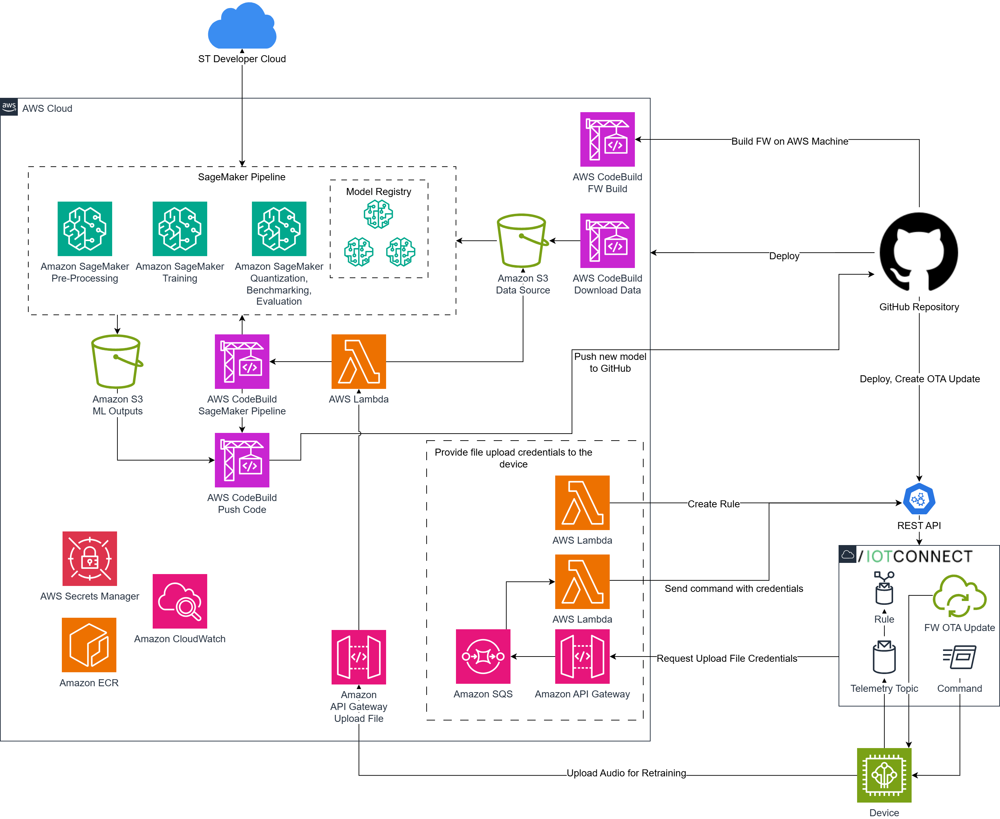

# Audio Classification: Cloud AI Retraining Pushed to the Edge Example

## Introduction

This repository contains the **IoTConnect + FreeRTOS STM32U5 ML demo** for real‑time urban noise classification and over‑the‑air (OTA) lifecycle management. It combines:
- **Device firmware** for the ST **B‑U585I‑IOT02A Discovery kit** (STM32U5 Secure MCU),
- **Infrastructure‑as‑code (AWS CDK)** to stand up retraining and delivery pipelines,
- **IoTConnect automation scripts** to provision device templates, rules, and OTA jobs.

The demo is built to deliver **actionable insights** with low latency at the edge while preserving a secure, scalable path to iterate models in production.

## Project Scope

Originally developed from a collaborative GitHub project with AWS, this local version enables streamlined, on‑site operation using **pre‑generated AI model files** under STMicroelectronics’ [SLA0044 license](https://www.st.com/resource/en/license/SLA0044_SE-MW.pdf). The system also supports **automatic model retraining from new field data**, letting you improve accuracy without replacing devices.

### Recognized Sounds

The supplied models detect representative urban events, including:

- Alarms
- Dog Barking
- Rushing Water
- Race Car / Auto Racing
- Vehicle Horns

> You can extend or refine the classes through the retraining flow described below.

### Telemetry and Confidence Reporting

Each classification publishes a **confidence** value. Thresholds can be **tuned per class** so you can balance sensitivity vs. false positives for your deployment.

## Key Features

### Optimized for Efficiency: Local Processing Advantages

The firmware runs inference **on‑device** (STM32U5), reducing latency, cloud traffic, and power draw—ideal for battery or energy‑harvested use cases.

### Advanced Noise Classification

Signal processing and embedded ML distinguish between noisy urban environments and target events, enabling targeted responses and richer city analytics.

### Harmonized System Integration

Designed to complement your existing monitoring stack, this solution adds audio intelligence alongside video or telemetry feeds for a more complete picture.

### Powered by IoTConnect and AWS

IoTConnect provides device management, rules, and OTA; AWS provides the managed backbone for training, data, and CI/CD automation.

### Automatic Deployment

Included **GitHub Actions** and **AWS CDK** templates provision cloud resources and wire up the demo end‑to‑end with minimal manual steps.

### Retraining (Enhanced since the first release)

This version focuses on **closing the loop** from field data to an improved model on the device:

- **Push‑button pipeline**: New/unknown audio samples collected by the device are routed to the cloud and trigger a retraining workflow.
- **Controllable sample emphasis**: Use the CDK context parameter **`TRAINING_SAMPLE_REPEAT_NUMBER`** to up‑weight difficult or unknown samples during training.¹
- **Automated packaging & delivery**: The trained model is compiled for STM32 (via ST DevCloud), firmware is rebuilt, and an **OTA update** is published through IoTConnect.
- **Branch‑based promotion**: The **`retrained-model`** branch acts as the integration gate for the build‑and‑update workflow; delete it after merging to ensure the next retrain picks up your latest changes.²

> See **Getting Started** for links to the step‑by‑step Demo and Development guides.

## Getting Started

### Full Demonstration Setup

Recreate the end‑to‑end environment (device, cloud, and dashboards) following the **[ML Audio Classifier Demo Setup Guide](DEMO.md)**.²

### Development Environment Setup

Build locally, run the CDK, and invoke IoTConnect automation using the **[Development Instructions](DEVELOPMENT.md)**.¹

## Solution Architecture

## Important Notes

- When updating firmware in `main`, increment `APP_VERSION_MINOR` in  
  `stm32/Projects/b_u585i_iot02a_ntz/Src/ota_pal/ota_firmware_version.c`.²
- Delete the **`retrained-model`** branch after each retrain cycle so subsequent retrains incorporate your latest `main` changes.²

---

¹ The `TRAINING_SAMPLE_REPEAT_NUMBER` CDK parameter and CDK/CLI usage are documented in the Development guide.  
² The retrain workflow, `retrained-model` usage, and versioning instructions are documented in the current README and Demo guide.

